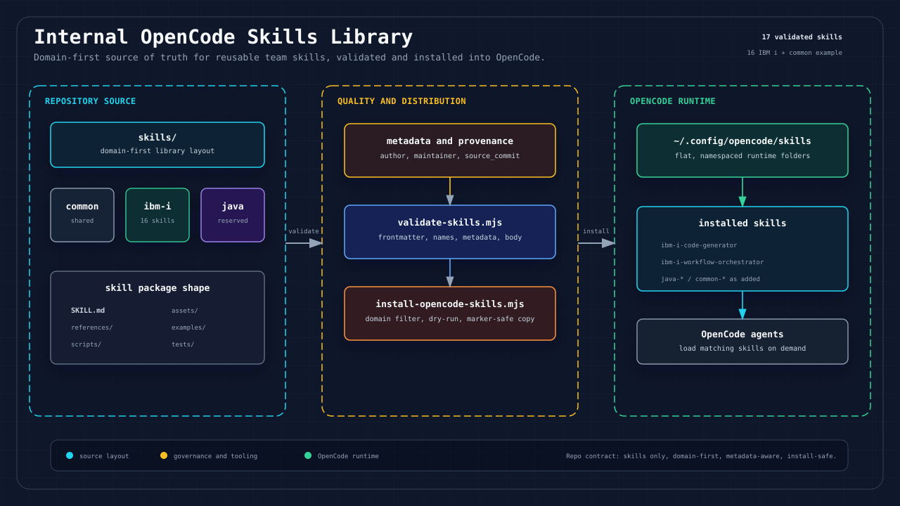

# Internal OpenCode Skills Library



This repository manages reusable OpenCode skills for internal engineering work.

The library is intentionally simple:

- Skills are grouped by domain in this repository.
- Skills are installed into OpenCode as flat, namespaced folders.
- The repository manages skills only, not agents or commands.

## Repository Layout

```text
skills/
  common/       Shared skills that apply across domains
  ibm-i/        IBM i skill family for requirements, specs, DDS, code, review, and tests
  java/         Java, Spring, Maven, Gradle, JVM, and testing skills
  legacy-spec-factory/
                Reverse-modernization skill family for legacy evidence-to-spec workflows
templates/
  skill/        Starter template for new skills
docs/           Authoring, naming, and installation guidance
scripts/        Validation and OpenCode installation utilities
```

## Included Skill Families

### IBM i

The IBM i family was migrated from `wwa-lab/build-agent-skill` after stabilization. It contains 16 skills covering the full IBM i delivery chain:

- Requirement intake and normalization.
- Existing RPGLE/CLLE source analysis.
- Impact analysis for enhancement work.
- Functional specs, technical designs, program specs, and file specs.
- RPGLE/CLLE and DDS generation.
- Spec, DDS, code, and compile-safety review.
- Unit test planning and executable SQL/CL test scaffold generation.
- Workflow orchestration for routing and batch `task.md` execution.

See `skills/ibm-i/README.md` for the full map.

Pending internal pilot skills are reserved but not installed until their `SKILL.md` files are copied in:

| Future Skill | Author | Status |
|--------------|--------|--------|
| `ibm-i-requirement-intake` | Oliver | Placeholder only |
| `ibm-i-ut-plan-to-xml` | Kevin | Placeholder only |

### Legacy Spec Factory

The Legacy Spec Factory family was migrated from `wwa-lab/legacy-spec-factory`
as a public-stable baseline at source commit `8871a6b`. It contains 21
preserved-name skills for reverse-modernization work:

- Evidence intake, inventory, and IBM i source/runtime analysis.
- Program, flow, module, screen/report, and data-model understanding.
- BRD, spec, modernization decision, traceability, and SDD handoff packaging.
- SME review facilitation, golden master test planning, HTML export, and step governance.
- Runtime portability checks across Codex, Claude Code, and OpenCode.

This family uses `skills/legacy-spec-factory/domain.json` with
`"nameStrategy": "preserve"`, so OpenCode installs names such as
`legacy-ibmi-inventory` and `legacy-spec-writer` without adding another prefix.

See `skills/legacy-spec-factory/README.md` for the full map.

## Quick Start

Validate the library:

```bash
node scripts/validate-skills.mjs
```

Preview OpenCode installation:

```bash
node scripts/install-opencode-skills.mjs --dry-run --include-examples
```

Install all real skills into the default OpenCode skills directory:

```bash
node scripts/install-opencode-skills.mjs
```

Install only one domain:

```bash
node scripts/install-opencode-skills.mjs --domain java
```

Install the IBM i family:

```bash
node scripts/install-opencode-skills.mjs --domain ibm-i
```

Install the Legacy Spec Factory family:

```bash
node scripts/install-opencode-skills.mjs --domain legacy-spec-factory
```

The default destination is:

```text
~/.config/opencode/skills
```

Use `--dest <path>` to install elsewhere.

## Creating a Skill

1. Copy `templates/skill` into `skills/<domain>/<skill-name>`.
2. Update `SKILL.md` frontmatter.
3. Keep the `name` field in the form `<domain>-<skill-name>`, unless the
   domain has an approved preserved-name strategy in `domain.json`.
4. Put long details in `references/`, deterministic helpers in `scripts/`, reusable files in `assets/`, samples in `examples/`, and fragile behavior checks in `tests/`.
5. Run `node scripts/validate-skills.mjs`.

Example:

```text
skills/ibm-i/rpg-modernization/SKILL.md
```

```yaml
---
name: ibm-i-rpg-modernization
description: Use when modernizing IBM i RPG applications, analyzing RPG code, extracting business rules, or planning RPG refactors.
---
```

## Docs

- `docs/skill-authoring.md`
- `docs/import-existing-skills.md`
- `docs/naming-conventions.md`
- `docs/opencode-installation.md`
