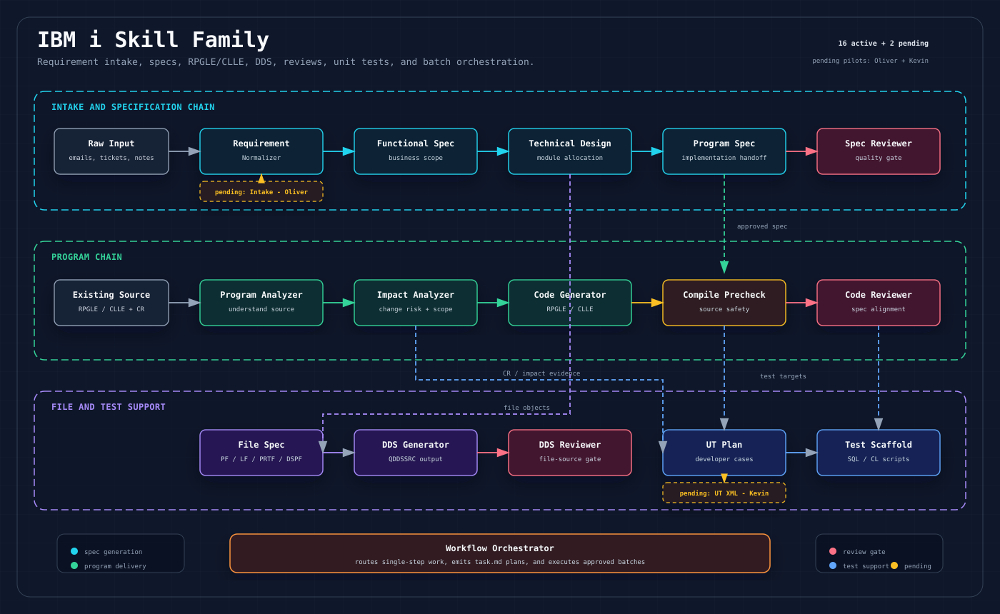

# IBM i Skill Family



This domain contains the internal IBM i skill family migrated from `wwa-lab/build-agent-skill` at source commit `479a427`.
The original Apache-2.0 license is retained in `skills/ibm-i/LICENSE`.

It supports IBM i (AS/400, iSeries) enterprise delivery across requirement intake, RPGLE/CLLE program analysis, specification, DDS, source generation, review, unit test planning, and executable SQL/CL test scaffold generation.

## Chain

```text
Raw Input -> Requirement Normalizer -> Functional Spec -> Technical Design
                                           |                  |
Existing Source -> Program Analyzer -> Impact Analyzer        |
                         (+ CR)                              |
                                                              +-> Program Spec -> Code Generator -> Compile Precheck -> Code Reviewer
                                                              |
                                                              +-> File Spec -> DDS Generator -> DDS Reviewer

Any spec or CR -> UT Plan Generator -> Test Scaffold
Any stage      -> Workflow Orchestrator
```

## Skills

| Skill | Path | Purpose |
|-------|------|---------|
| `ibm-i-requirement-normalizer` | `requirement-normalizer/` | Normalize messy business or technical input into a structured requirement package. |
| `ibm-i-program-analyzer` | `program-analyzer/` | Analyze existing RPGLE/CLLE source for comprehension, flow, interfaces, I/O, and dependencies. |
| `ibm-i-impact-analyzer` | `impact-analyzer/` | Analyze existing source plus a change request to produce impact, risk, and handoff guidance. |
| `ibm-i-functional-spec` | `functional-spec/` | Generate business-functional specifications from requirements or change requests. |
| `ibm-i-technical-design` | `technical-design/` | Generate technical design documents with module allocation, processing flow, object interaction, and impact. |
| `ibm-i-program-spec` | `program-spec/` | Generate implementation-ready Program Specs for RPGLE and CLLE work. |
| `ibm-i-file-spec` | `file-spec/` | Generate DDS-focused File Specs for PF, LF, PRTF, and DSPF objects. |
| `ibm-i-code-generator` | `code-generator/` | Generate RPGLE or CLLE source from an approved Program Spec. |
| `ibm-i-dds-generator` | `dds-generator/` | Generate DDS source from File Spec JSON contracts. |
| `ibm-i-ut-plan-generator` | `ut-plan-generator/` | Generate developer-level unit test plans from specs, CRs, or raw inputs. |
| `ibm-i-test-scaffold` | `test-scaffold/` | Generate executable SQL/CL scripts for setup, compile, execution, verification, and cleanup. |
| `ibm-i-compile-precheck` | `compile-precheck/` | Review RPGLE/CLLE source for compile-safety issues before transport or compile. |
| `ibm-i-spec-reviewer` | `spec-reviewer/` | Review IBM i specs for layer boundary, completeness, traceability, and downstream readiness. |
| `ibm-i-dds-reviewer` | `dds-reviewer/` | Review DDS source against File Specs for correctness, syntax, completeness, and type-specific rules. |
| `ibm-i-code-reviewer` | `code-reviewer/` | Review RPGLE/CLLE source against Program Specs for correctness and enhancement safety. |
| `ibm-i-workflow-orchestrator` | `workflow-orchestrator/` | Route work to the right skill, plan batch `task.md` runs, and execute approved batches. |

## Pending Internal Pilot Imports

These placeholders reserve final paths for internal pilot skills that are not in the public source repo yet. They intentionally do not contain `SKILL.md`, so validation and installation skip them until the internal skill content is copied in.

| Future Skill | Author | Placeholder Path | Notes |
|--------------|--------|------------------|-------|
| `ibm-i-requirement-intake` | Oliver | `requirement-intake/` | Internal legacy name: `as400-requirment-intake`; use corrected spelling and IBM i namespace on import. |
| `ibm-i-ut-plan-to-xml` | Kevin | `ut-plan-to-xml/` | Converts IBM i UT Plan artifacts into XML once internal pilot content is imported. |

## Design Principles

- Layer boundary discipline: each skill stays in its document or artifact layer.
- BR-xx continuity: business rule IDs carry through requirement, spec, design, code, and review.
- Enhancement-first: skills support real IBM i BAU change work, not only greenfield delivery.
- Anti-hallucination: unknown object names, rules, and system details must remain explicit TBDs.
- Tiered output: spec skills scale Lite, Standard, or Full based on change complexity.
- Review gates: specs, DDS, source code, and compile safety each have separate reviewers.

## Installation

Preview installation:

```bash
node scripts/install-opencode-skills.mjs --domain ibm-i --dry-run
```

Install into OpenCode:

```bash
node scripts/install-opencode-skills.mjs --domain ibm-i
```
