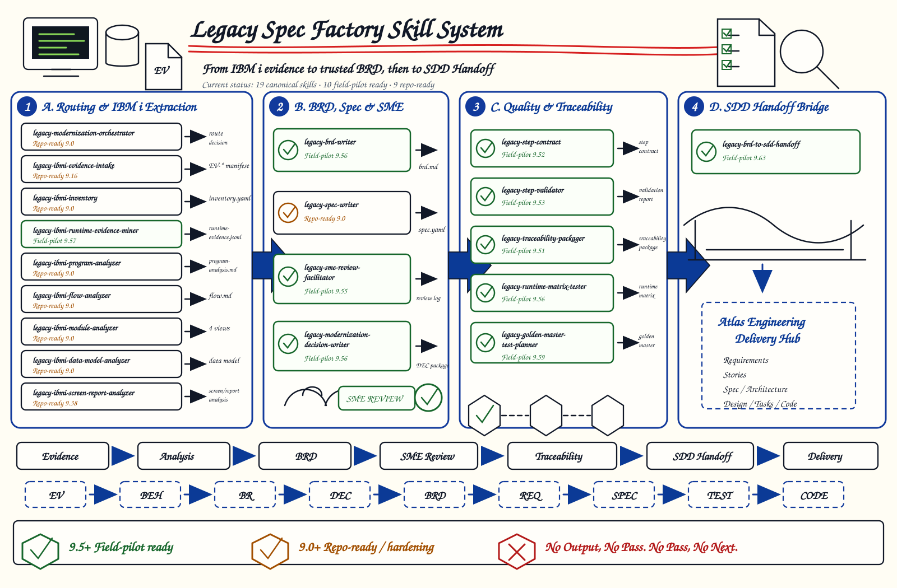

# Legacy Spec Factory Skill Family



This domain captures the public-stable baseline of `wwa-lab/legacy-spec-factory`
at source commit `3b6a16b`.

Legacy Spec Factory is the reverse-modernization companion to the IBM i delivery
family. It turns IBM i / AS400 legacy evidence into reviewable, evidence-backed
specification packages that can feed downstream AI-native SDLC work.

The original Apache-2.0 license, notice, and author file are retained in this
domain.

## Name Strategy

This family uses `domain.json` with `"nameStrategy": "preserve"` because the
source skills already have stable flat OpenCode names such as
`legacy-ibmi-inventory` and `legacy-spec-writer`.

## Chain

```text
Raw Office / Visio / PDF / image documents
  -> Document Evidence Intake
  -> Flow Context Normalization
  -> Module Context Intake
  -> Selective IBM i Evidence Intake / Inventory / Source Analysis
  -> Module Analysis
  -> BRD / Spec Synthesis
  -> SME Review and Decisions
  -> Traceability Package / SDD Handoff
  -> Forward SDLC
```

## Skills

| Skill | Purpose |
|-------|---------|
| `legacy-modernization-orchestrator` | Entry-point router for reverse-modernization work and next-step selection. |
| `legacy-document-evidence-intake` | Normalize raw Office, Visio, PDF, image, and scanned document evidence into reviewable text/manifest packages. |
| `legacy-flow-context-normalizer` | Convert scattered documents, specs, RAG summaries, and SME notes into draft four-view context for SME review. |
| `legacy-module-context-intake` | Normalize approved module-first context, RAG output, or accepted sparse flow context before module analysis. |
| `legacy-ibmi-evidence-intake` | Register, classify, authorize, and govern modernization evidence before analysis. |
| `legacy-ibmi-inventory` | Build the initial IBM i asset inventory and object map. |
| `legacy-ibmi-program-analyzer` | Analyze one RPGLE, CLLE, or COBOL program with evidence-backed behavior extraction. |
| `legacy-ibmi-flow-analyzer` | Analyze one end-to-end business transaction across multiple IBM i programs. |
| `legacy-ibmi-module-analyzer` | Synthesize multiple flows into the canonical module-level four-view analysis. |
| `legacy-ibmi-data-model-analyzer` | Build evidence-backed data dictionaries, access paths, and CRUD matrices. |
| `legacy-ibmi-screen-report-analyzer` | Analyze DSPF, PRTF, menus, subfiles, reports, and presentation behavior. |
| `legacy-ibmi-runtime-evidence-miner` | Extract approved runtime observations from job logs and spool/report evidence. |
| `legacy-ibmi-batch-digest` | Produce an SME-friendly digest over many per-program analysis artifacts. |
| `legacy-brd-writer` | Produce a business-facing BRD from approved reverse-engineering analysis. |
| `legacy-spec-writer` | Produce evidence-backed `spec.yaml` and `spec.md` capability packages. |
| `legacy-modernization-decision-writer` | Produce structured modernization decision records when decisions need separate governance. |
| `legacy-sme-review-facilitator` | Prepare and record SME review sessions, decisions, and sign-offs. |
| `legacy-golden-master-test-planner` | Plan old-vs-new golden master tests from approved specs and runtime evidence. |
| `legacy-traceability-packager` | Package and audit end-to-end traceability for a capability. |
| `legacy-brd-to-sdd-handoff` | Validate and package an Atlas-compatible SDD handoff. |
| `legacy-html-exporter` | Export stakeholder-facing Markdown artifacts into standalone HTML companions. |
| `legacy-step-contract` | Define the shared step contract for the reverse chain. |
| `legacy-step-validator` | Validate produced artifacts against the shared step contract. |
| `legacy-runtime-matrix-tester` | Check runtime portability across Codex, Claude Code, and OpenCode. |

## Shared Resources

The imported skills depend on shared family resources:

- `docs/legacy-spec-factory/`
- `schemas/legacy-spec-factory/`
- `templates/legacy-spec-factory/`
- `scripts/legacy-spec-factory/`

## Installation

Preview installation:

```bash
node scripts/install-opencode-skills.mjs --domain legacy-spec-factory --dry-run
```

Install into OpenCode:

```bash
node scripts/install-opencode-skills.mjs --domain legacy-spec-factory
```
